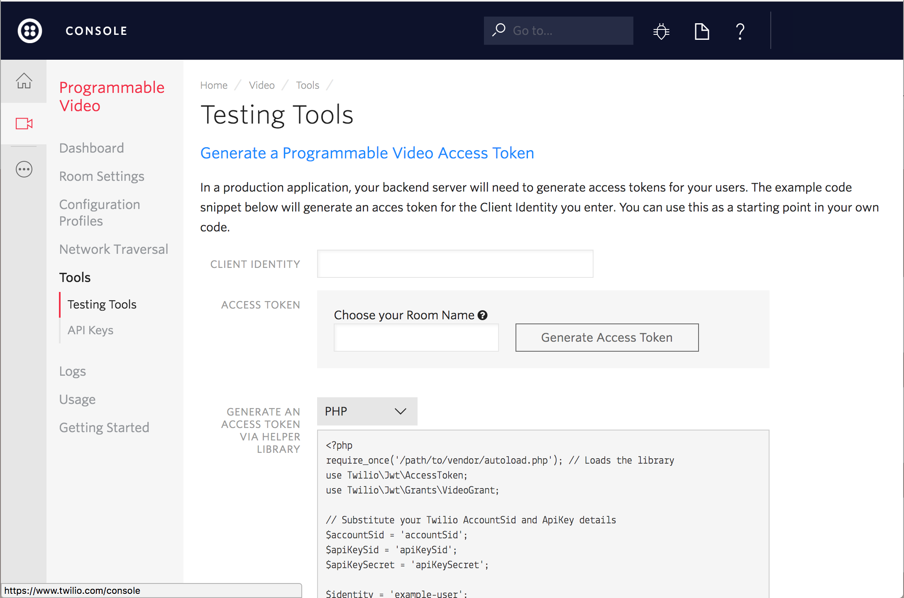

# Twilio Video ARKit Example

This project provides an example of how to use Twilio Programmable Video to stream a scene using ARKit in real-time on iOS. This example was provided as part of a blog post that you can find here.

## Setup

This project uses Apple's Swift 3.0 programming language for iOS. 

If you haven't used Twilio before, welcome! You'll need to [Sign up for a Twilio account](https://www.twilio.com/try-twilio) first. It's free!

### Prerequesites

To get started you need the following:

- An Apple device with an A9 or later processor (iPhone 6s or later, iPhone SE, any iPad Pro, or the 2017 iPad)
- [iOS 11 beta](https://www.apple.com/ios/ios-11-preview/)
- [XCode 9](https://developer.apple.com/download/)

### Cocoapods

1. Install [CocoaPods 1.0.0+](https://guides.cocoapods.org/using/getting-started.html).

1. Run `pod install` from the root directory of this project. CocoaPods will install `TwilioVideo.framework` and then set up an `xcworkspace`.

1. Open `ARKitExample.xcworkspace`.

Note: You may need to update the CocoaPods [Master Spec Repo](https://github.com/CocoaPods/Specs) by running `pod repo update master` in order to fetch the latest specs for TwilioVideo.

### Running the app

To get started with the Quickstart application follow these steps:

1. Open this projects .xcworkspace in Xcode

1. Type in an identity and click on "Generate Access Token" from the [Testing Tools page](https://www.twilio.com/user/account/video/dev-tools/testing-tools). Note: If you enter the Room Name make sure to use room name *Arkit* as this is hard-coded in the `TVIConnectOptions` builder defined in ViewController.swift

  

1. Paste the token you generated in the earlier step in ViewController.swift assigning it to `accessToken`

1. Run the app on an Apple device with an A9 or later processor (iPhone 6s or later, iPhone SE, any iPad Pro, or the 2017 iPad)

1. To see the captured scene being sent to the video room by this app you can run the [quickstart app](https://github.com/twilio/video-quickstart-swift) on a different device or simulator. For this to work properly you need to **generate a new access token with a different identity** and connect to the same room *Arkit* using the quickstart app.