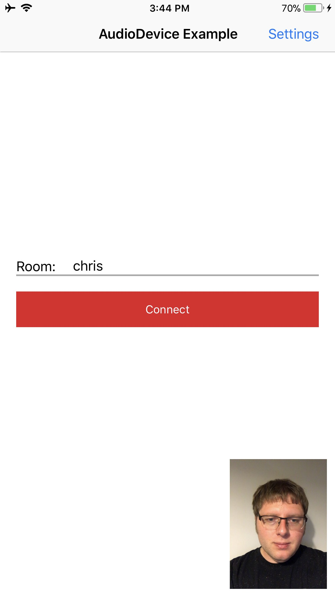

# Twilio Video TVIAudioDevice Example

The project demonstrates how to use Twilio's Programmable Video SDK with audio playback and recording functionality provided by a custom `TVIAudioDevice`.

The example demonstrates the following custom audio devices:

**ExampleCoreAudioDevice**

Uses a RemoteIO audio unit to playback stereo audio at up to 48 kHz. In contrast to `TVIDefaultAudioDevice`, this class does not record audio and is intended for high quality playback. Since recording is not needed this device does not use the built in echo cancellation provided by CoreAudio's VoiceProcessingIO audio unit nor does it require microphone permissions from the user.

**ExampleAVAudioEngineDevice**

Uses CoreAudio's VoiceProcessingIO audio unit to playback and record audio at up to 48KHz with built-in echo cancellation. The example uses AVAudioEngine in manual rendering mode for mixing the Remote Participant's audio and audio from a file. CoreAudio receives the mixed audio samples from the AVAudioUnit's 
output node.

This diagram describes how ExampleAVAudioEngineDevice uses TwilioVideo, AVAudioEngine, and CoreAudio -

Please note, ExampleAVAudioEngineDevice requires iOS 11.0 or above.

### Setup

See the master [README](https://github.com/twilio/video-quickstart-swift/blob/master/README.md) for instructions on how to generate access tokens and connect to a Room.

This example requires Xcode 9.0 and the iOS 11.0 SDK, as well as a device running iOS 9.0 or above.

### Running

Once you have configured your access token, build and run the example. You will be presented with the following screen:

<kbd></kbd>

Tap the audio device button to select an audio device: 

<kbd></kbd>

Once the audio device of your choice is selected, enter the room name.

<kbd></kbd>

Tap the "Connect" button to join a Room. Once you've joined you will be sharing video and audio if `ExampleAVAudioEngineDevice` is used. However the audio will not be shared if `ExampleCoreAudioDevice` is used. In order to playback audio from a remote Participant you will need a Client which supports audio recording. The easiest way to do this is to build and run the normal QuickStart [example](https://github.com/twilio/video-quickstart-swift/tree/master/VideoQuickStart) and join the same Room.

After the remote Participant has joined you should be able to hear their audio. If you are using the `ExampleCoreAudioDevice`, watch out if both devices are in the same physical space, because `ExampleCoreAudioDevice` does not use echo cancellation.

### Known Issues

The AVAudioSession is configured and activated at device initialization time. Ideally, it would be better to activate the AVAudioSession only when audio playback or recording is needed.