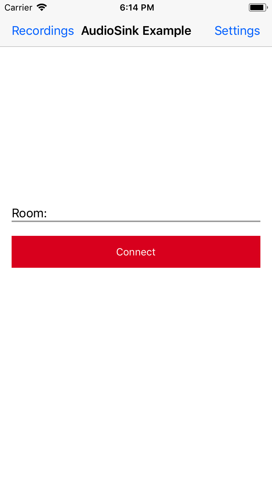

# Twilio Video TVIAudioSink Example

The project demonstrates how to use Twilio's Programmable Video SDK to access raw audio samples using the `TVIAudioSink` API on `TVIAudioTrack`. Local and remote audio is recorded using `AVFoundation.framework` and speech is recognized using `Speech.framework`.

### Setup

See the master [README](https://github.com/twilio/video-quickstart-swift/blob/master/README.md) for instructions on how to generate access tokens and connect to a Room.

This example requires Xcode 9.0, and a device running iOS 10.0 or above.

### Running

Once you have setup your access token install and run the example. You will be presented with the following screen:

After you connect to a Room tap on your camera preview to begin recognizing local audio. Once other Participants join you can select their video to recognize remote speech.

// TODO: Image of connected Room with speech recognition here.

Audio is automatically recorded when you join a Room. After disconnecting, tap "Recordings" to browse a list of your `TVIAudioTrack`s recorded using `ExampleAudioRecorder`. Select a recording cell to being playback using `AVPlayerViewController`, or swipe to delete the file.

### Known Issues

Local audio samples are not raised until at least one underlying WebRTC PeerConnection is negotiated. In a Peer-to-Peer Room it is not possible to record or recognize audio until at least one other Participant joins. The same limitation does not apply to Group Rooms where there is a persistent PeerConnection with Twilio's media servers.
