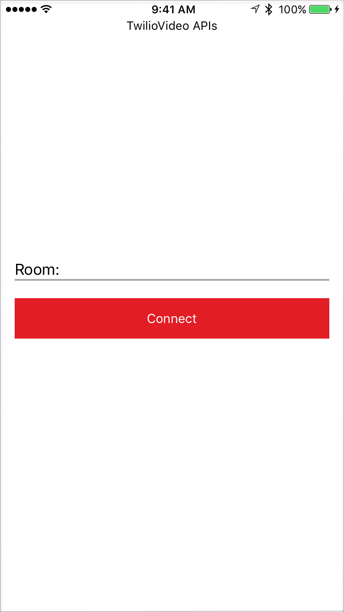
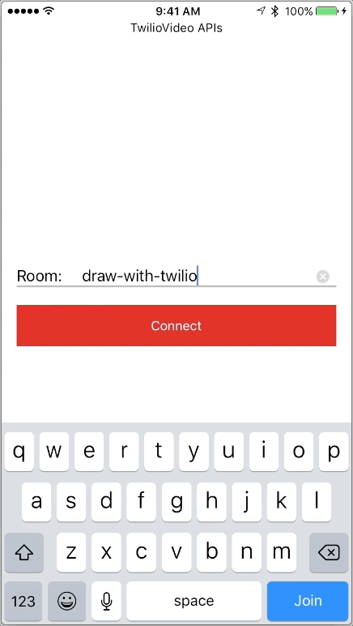

# Twilio Video Data Tracks Example

The DataTrack API lets you create a DataTrack channel which can be used to send low latency messages to zero or more receivers subscribed to the data. For a detailed guide about DataTracks reference [our documentation](https://www.twilio.com/docs/video/ios-v3-using-the-datatrack-api). 
 
This example illustrates how to use the DataTrack API to write a simple collaborative drawing app.

In this example, participants can join a Room and begin drawing on a UIView. The drawing is shared to all other participants using the DataTrack API to provide a collaborative whiteboard experience. Once disconnected from the Room, your UIView clears and your drawings are removed from all other participant's UIView as well. Local participant's drawings will be presented in black color while remote participant's drawing will be presented in light gray color.

### Setup

See the master [README](https://github.com/twilio/video-quickstart-ios/blob/3.x/README.md) for instructions on how to generate access tokens and connect to a Room.

### Run the application 

Once you have setup your access token you can run the application and you will be presented with the following screen:

### Connect and draw! 

Once connected you can start drawing and see other connected Participant's drawing.

