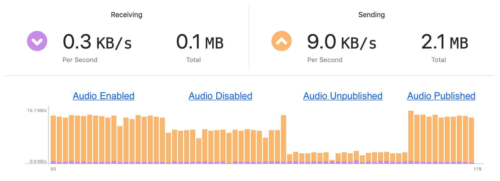
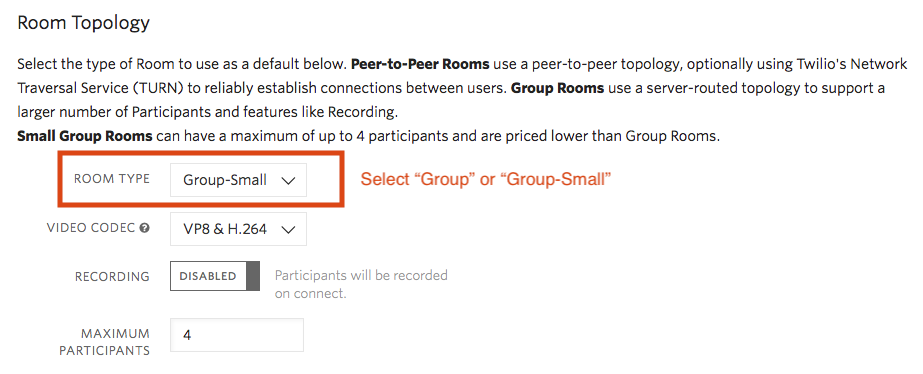
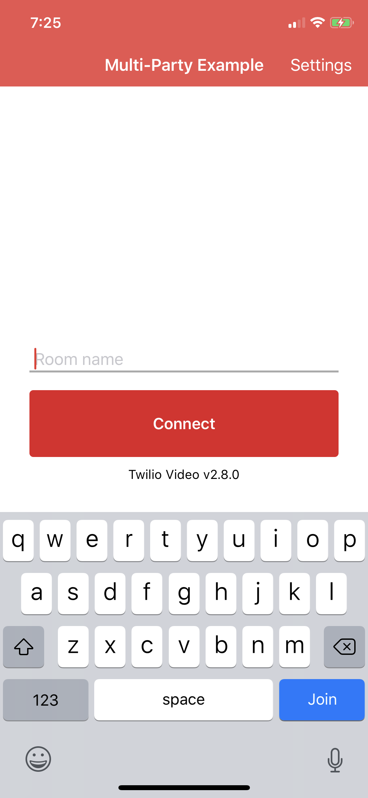

# Twilio Video Multi-Party Example

The project demonstrates how to use Twilio's Programmable Video SDK for multi-party conferencing with up to 4 Participants in a Group Room.

### Key Classes

Two `UIViewController` classes and one `UIView` comprise the main functionality of the app.

**MainViewController**

The landing page for the example. This class coordinates authorization of the Video Client, and accepts user input to determine which Room to connect to. The shared settings UI is accessible from the ViewController's navigation items.

*Please note that video bitrate configurations on the settings page are ignored, since the example manages bitrate dynamically.*

**MultiPartyViewController**

Coordinates a Video conference in a Room, including:

1. Configuring local audio & video Tracks.
2. Connecting to the Room.
3. Rendering local and remote video.
4. Routing dominant speaker events to the appropriate subviews.
5. Displaying the Local Participant's [Network Quality Level](https://www.twilio.com/docs/video/using-network-quality-api).
6. Raising fatal errors to the developer.
7. Disconnecting from the Room, and stopping `TVICameraSource`.

The controller manages your LocalParticipant's media, reconfiguring the CameraSource and EncodingParameters for both 1:1 and multi-party scenarios. In order to conserve bandwidth, the controller will unpublish the Participant's `LocalAudioTrack` if it remains disabled for a long time.

Xcode's Network Report debugger demonstrates how much send bandwidth is consumed by a `LocalAudioTrack` in a Group Room as it is disabled, unpublished, and then republished later:

<kbd></kbd>

**RemoteParticipantView**

Displays a single `TVIRemoteParticipant`, with up to one `TVIRemoteVideoTrack` and handles [Dominant Speaker](https://www.twilio.com/docs/video/detecting-dominant-speaker) events.

### Setup

See the master [README](https://github.com/twilio/video-quickstart-ios/blob/master/README.md) for instructions on how to generate access tokens that are needed to connect to a Room.

You will need to provide a hardcoded token, or token server URL in [MainViewController.swift](MultiPartyExample/MainViewController.swift). Please note that this example is designed to work in a Group Room, including the usage of [VP8 Simulcast](https://www.twilio.com/docs/video/tutorials/working-with-vp8-simulcast), [Dominant Speaker](https://www.twilio.com/docs/video/detecting-dominant-speaker) and [Network Quality](https://www.twilio.com/docs/video/using-network-quality-api) events. You can create Group Rooms using the [REST API](https://www.twilio.com/docs/video/api/rooms-resource), or by selecting them as the default type in the [console](https://www.twilio.com/console/video/configure).

<kbd></kbd>

This example requires Xcode 10.0 and the iOS 12.0 SDK, as well as a device or simulator running iOS 10.0 or above. Sharing video from the camera is not supported on an iOS simulator.

### Running

Once you have setup your access token, install and run the example. You will be presented with the following screen:

<kbd></kbd>

Tapping "Connect" will authorize your Client, and then connect to a Room sharing audio and video. Once you've connected, video from up to 3 Remote Participants is shown, and the most recent dominant speaker is highlighted. Single tap on your Participant to mute and un-mute audio. Double tap on your Participant to switch the camera from front to back.

### Known Issues

**1. Not optimized for Peer-to-Peer Rooms**

This app is designed to be used in a Group Room. If you join a Peer-to-Peer Room then Dominant Speaker or Network Quality events will not be raised. Also, using VP8 simulcast in a Peer-to-Peer Room does not provide any benefit.
