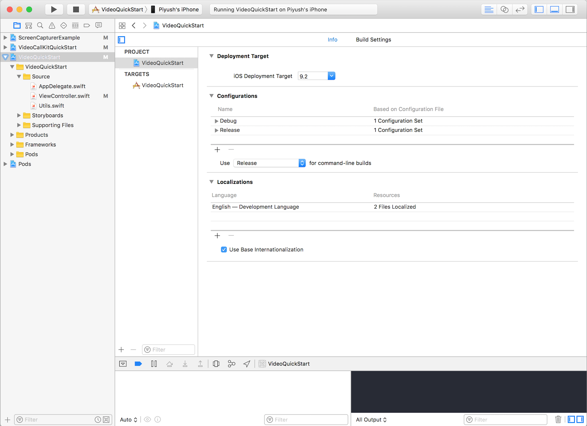
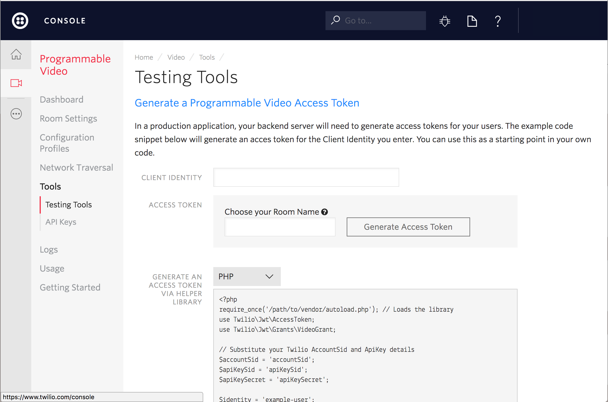
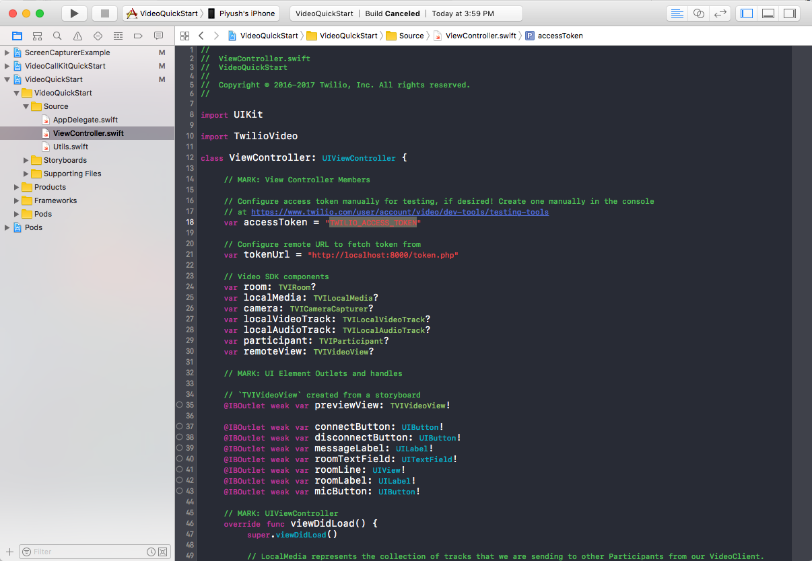
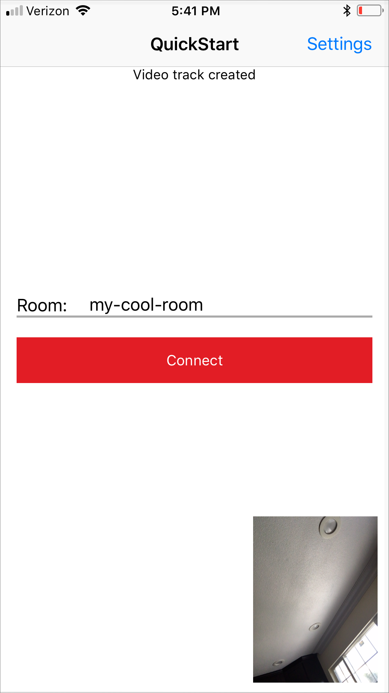
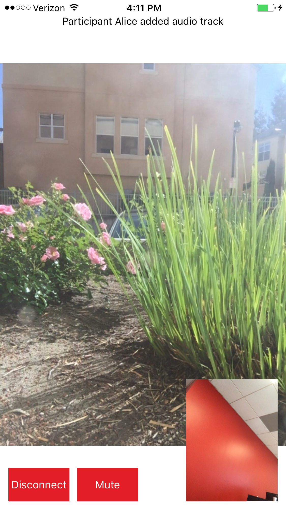

**NEW:** Please check out the newly open-sourced [multi-party video application](https://github.com/twilio/twilio-video-app-ios)
built with iOS Video SDK.

# Twilio Video Quickstart for iOS

> NOTE: These sample applications use the Twilio Video 3.x APIs. For examples using our 2.x APIs, please see the [2.x](https://github.com/twilio/video-quickstart-ios/tree/2.x) branch. For examples using our 1.x APIs, please see the [1.x](https://github.com/twilio/video-quickstart-ios/tree/1.x) branch.
> 
> Please see our [iOS 13 Migration Guide](https://github.com/twilio/twilio-video-ios/blob/Releases/iOS-13-Migration-Guide.md) for the latest information on iOS 13 and iPadOS 13.

Get started with Video on iOS:

- [Setup](#setup) - Get setup
- [Quickstart](#quickstart) - Run the Quickstart app
- [Examples](#examples) - Run the sample applications
- [Setup an Access Token Server](#setup-an-access-token-server) - Setup an access token server
- [More Documentation](#more-documentation) - More documentation related to the iOS Video SDK
- [Issues & Support](#issues-and-support) - Filing issues and general support
- [License](#license)

## Setup

This repository contains example code written in both Objective-C and Swift. The Swift examples use Apple's Swift 4.2 programming language for iOS.

If you haven't used Twilio before, welcome! You'll need to [Sign up for a Twilio account](https://www.twilio.com/try-twilio) first. It's free!

### CocoaPods

1. Install [CocoaPods 1.7.5 or newer](https://guides.cocoapods.org/using/getting-started.html).

2. Run `pod install` from the root directory of this project. CocoaPods will install `TwilioVideo.framework` and then set up an `xcworkspace`.

3. Open `VideoQuickStart.xcworkspace`.

Note: You may need to update the CocoaPods [Master Spec Repo](https://github.com/CocoaPods/Specs) by running `pod repo update master` in order to fetch the latest specs for TwilioVideo.

### Manual Integration

You can integrate `TwilioVideo.framework` manually by following these [install instructions](https://www.twilio.com/docs/video/ios-v3-getting-started#manual).

## Quickstart

### Running the Swift Quickstart

To get started with the Swift Quickstart application follow these steps:

1. Open the `VideoQuickStart` target from the `VideoQuickStart.xcworkspace` in Xcode

2. Type in an identity and click on "Generate Access Token" from the [Testing Tools page](https://www.twilio.com/console/video/runtime/testing-tools).

Note: If you enter the Room Name, then you can restrict this user's access to the specified Room only. Ideally, you want to implement and deploy an Access Token server to generate tokens. You can read more about setting up your own Access Token Server in this [section](#setup-an-access-token-server). Read this [tutorial](https://www.twilio.com/docs/api/video/user-identity-access-tokens) to learn more about Access Tokens.

3. Paste the token you generated in the earlier step in the `ViewController.swift`.

4. Run the Quickstart app on your iOS device or simulator.

5. As in Step 2, generate a new Token for another identity (such as "Bob"). Copy and paste the access token into `ViewController.swift` (replacing the one you used earlier). Build and run the app on a second physical device if you have one, or the iPhone simulator.

6. Once you have both apps running, enter an identical Room name (such as "my-cool-room") into both apps, and tap "Connect" to connect to a video Room (you'll be prompted for mic and camera access on the physical device). Once you've connected from both devices, you should see video!

### Running the Objective-C Quickstart

To get started with the Objective-C Quickstart application follow these steps:

1. Open the `ObjCVideoQuickstart` target from the `VideoQuickStart.xcworkspace` in Xcode

2. Type in an identity and click on "Generate Access Token" from the [Testing Tools page](https://www.twilio.com/console/video/runtime/testing-tools).

Note: If you enter the Room Name, then you can restrict this user's access to the specified Room only. Ideally, you want to implement and deploy an Access Token server to generate tokens. You can read more about setting up your own Access Token Server in this [section](#setup-an-access-token-server). Read this [tutorial](https://www.twilio.com/docs/api/video/user-identity-access-tokens) to learn more about Access Tokens.

3. Paste the token you generated in the earlier step in the `ViewController.m`.

4. Run the Quickstart app on your iOS device or simulator.

5. As in Step 2, generate a new Token for another identity (such as "Bob"). Copy and paste the access token into `ViewController.m` (replacing the one you used earlier). Build and run the app on a second physical device if you have one, or the iPhone simulator.

6. Once you have both apps running, enter an identical Room name (such as "my-cool-room") into both apps, and tap "Connect" to connect to a video Room (you'll be prompted for mic and camera access on the physical device). Once you've connected from both devices, you should see video!

### Using a Simulator

You can use the iOS Simulator that comes with Xcode to do your testing, but local video will not be shared since the Simulator cannot access a camera.

Note: If you have an iOS device, you can now run apps from Xcode on your device without a paid developer account.

## Examples

You will also find additional examples that provide more advanced use cases of the Video SDK. The currently included examples are as follows:

- [AudioDevice](AudioDeviceExample) - Provide your own means to playback and record audio using a custom `TVIAudioDevice` and [CoreAudio](https://developer.apple.com/documentation/coreaudio).
- [AudioSink](AudioSinkExample) - Access raw audio samples and record them to disk using [AVFoundation](https://developer.apple.com/documentation/avfoundation). Perform live voice recognition using Apple's [Speech](https://developer.apple.com/documentation/speech) framework.
- [ARKit](ARKitExample) - Captures augmented reality content with `ARKit` and uses `SceneKit` to place objects in the virtual scene. The resulting rendering is previewed locally, and shared in a `TVIRoom` via a custom `TVIVideoSource` source. This app requires Xcode 11 & iOS 11.
- [AVPlayer](AVPlayerExample) - Shows how to use `AVPlayer` to stream Audio & Video content while connected to a `TVIRoom`.
- [CallKit](VideoCallKitQuickStart) - Shows how to use Twilio Video with the [CallKit](https://developer.apple.com/reference/callkit) framework.
- [DataTrack](DataTrackExample) - Shows how to use the Data Track APIs for interactive drawing.
- [MultiParty](MultiPartyExample) - Video conferencing in a Group Room with up to 4 Participants, dominant speaker detection and network quality events.
- [ReplayKit](ReplayKitExample) - Shows how to use ReplayKit to share the screen, and microphone via `TVIVideoSource` and `TVIAudioDevice`.
- [Screen Capturer](ScreenCapturerExample) - Use a custom `TVIVideoSource` to capture the contents of a `WKWebView`.

## Setup an Access Token Server

Using Twilio's Video client within your applications requires an access token. Access Tokens are short-lived credentials that are signed with a Twilio API Key Secret and contain grants which govern the actions the client holding the token is permitted to perform.

### Configuring the Access Token Server

If you want to be a little closer to a real environment, you can download one of the video Quickstart server applications - for instance, [Video Quickstart: PHP](https://github.com/TwilioDevEd/video-quickstart-php) and either run it locally, or install it on a server. You can review a detailed [tutorial](https://www.twilio.com/docs/api/video/user-identity-access-tokens#generating-access-tokens).

You'll need to gather a couple of configuration options from the Twilio developer console before running it, so read the directions on the Quickstart. You'll copy the config.example.php file to a config.php file, and then add in these credentials:

 Credential | Description
---------- | -----------
Twilio Account SID | Your main Twilio account identifier - [find it on your dashboard](https://www.twilio.com/console).
API Key | Used to authenticate - [generate one here](https://www.twilio.com/console/video/runtime/api-keys).
API Secret | Used to authenticate - [just like the above, you'll get one here](https://www.twilio.com/console/video/runtime/api-keys).

Use whatever clever username you would like for the identity. If you enter the Room Name, then you can restrict this users access to the specified Room only. Read this [tutorial](https://www.twilio.com/docs/api/video/user-identity-access-tokens) for more information on Access Tokens.

#### A Note on API Keys

When you generate an API key pair at the URLs above, your API Secret will only
be shown once - make sure to save this in a secure location.

#### Running the Video Quickstart with ngrok

Because we suggest that you run your video chat application on actual iOS device so that you can use the camera on the device, you'll need to provide an externally accessible URL for the app (the iOS simulator will be fine with localhost). [Ngrok](https://ngrok.com/) creates a publicly accessible URL that you can use to send HTTP/HTTPS traffic to a server running on your localhost. Use HTTPS to make web connections that retrieve a Twilio access token.

When you get a URL from ngrok, go ahead and update `ViewController.swift` with the new URL. If you go down this path, be sure to follow the directions in the comments in the `viewDidLoad()` method at the top of the source file - you will need to uncomment one line, and comment out another. You will also need to update the code if your ngrok URL changes.

For this Quickstart, the Application transport security settings are set to allow arbitrary HTTP loads for testing your app. For production applications, you'll definitely want to retrieve access tokens over HTTPS/SSL.

## More Documentation

You can find more documentation on getting started as well as our latest Docs below:

* [Getting Started](https://www.twilio.com/docs/video/ios-v3-getting-started)
* [Docs](https://twilio.github.io/twilio-video-ios/docs/latest/index.html)
* [iOS 13 Migration Guide](https://github.com/twilio/twilio-video-ios/blob/Releases/iOS-13-Migration-Guide.md)

## Issues and Support

Please file any issues you find here on Github.
Please ensure that you are not sharing any
[Personally Identifiable Information(PII)](https://www.twilio.com/docs/glossary/what-is-personally-identifiable-information-pii)
or sensitive account information (API keys, credentials, etc.) when reporting an issue.

For general inquiries related to the Video SDK you can file a [support ticket](https://support.twilio.com/hc/en-us/requests/new).

## License

[MIT License](https://github.com/twilio/video-quickstart-ios/blob/master/LICENSE)
