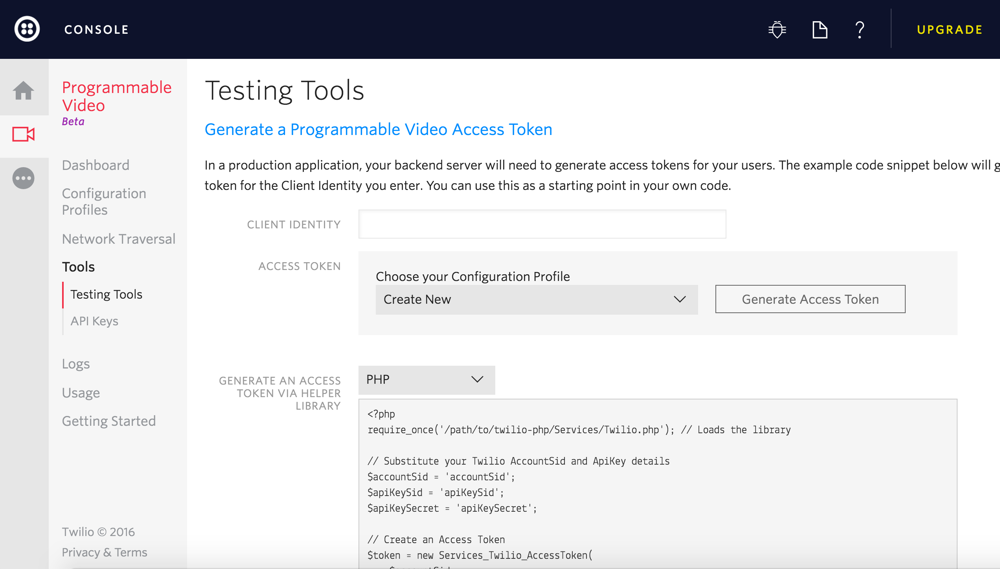
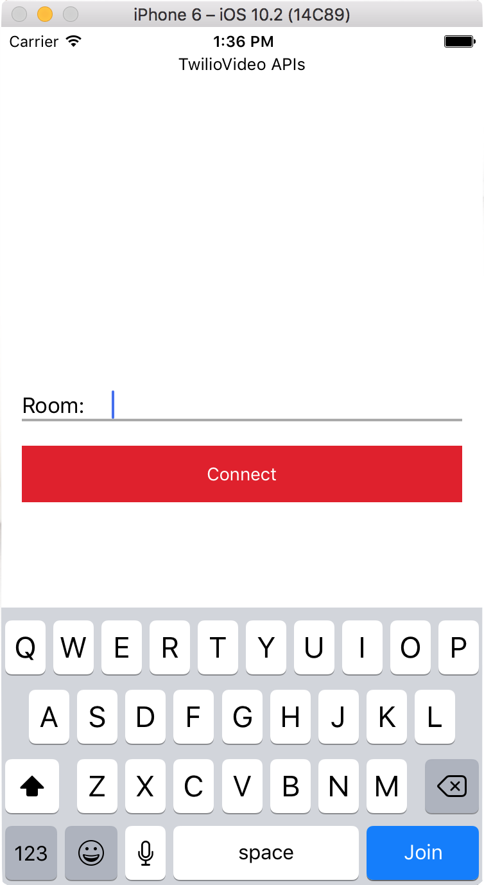

# Twilio Video Quickstart for Swift

Get started with Video on iOS:

- [Setup](#setup) - Get setup
- [Quickstart](#quickstart) - Run the quickstart app
- [Examples](#examples) - Run the sample applications
- [Setup an Access Token Server](#setup-an-access-token-server) - Setup an access token server
- [More Documentation](#more-documentation) - More documentation related to the iOS Video SDK
- [Issues & Support](#issues-and-support) - Filing issues and general support

## Setup 

### Twilio Library Setup for the Project

You will need to add the Twilio Video library to the project to compile and run. You can do this using the [Cocoapods](https://cocoapods.org/) dependency management system. 

#### Using Cocoapods

First, you will need to have Cocoapods 1.0.0+ installed on your Mac, so go ahead and do that if you haven't already - the directions are here: [Getting Started with Cocoapods](https://guides.cocoapods.org/using/getting-started.html). If you're not sure, type `pod --version` into a command line.

Next, just run `pod install` from the command line in the top level directory of this project. Cocoapods will install the Twilio library and then set up a .xcworkspace file that you will use to run your project from now on.

**Note: If you've used [Twilio's Cocoapods Spec Repo](https://github.com/twilio/cocoapod-specs) before you may need to update it by running `pod repo update twilio` before installing dependencies.** 

#### Using an Emulator

You can use the iOS Simulator that comes with Xcode to do your testing, but local video will not be shared since the Simulator cannot access a camera. 

**Note:If you have an iOS device, you can now run apps from Xcode on your device without a paid developer account.**

#### Prerequisites

This project uses Apple's Swift programming language 3.0 for iOS, and the only supported way to develop iOS apps is on an Apple computer running OS X and Xcode. We have tested this application with the latest versions of iOS (10.0) and Xcode (8.0) at the time of this writing.

#### About the Quickstart Project

This project consists of two sample apps: one using CallKit, and one without CallKit support.

The quickstarts will help you integrate Twilio Video directly into your iOS applications using Twilio's Video SDK. These examples are for Swift developers.

**Note: if your app uses Objective-C see [video-quickstart-objective-c](https://github.com/twilio/video-quickstart-objc/).**

The sample apps are written in Swift 3.0. You will need at least Xcode 8.0 in order to run the applications.

Review the code to see how how to set up key classes like `TVIVideoClient`, `TVIRoom`, `TVIParticipant`, `TVILocalMedia`, and `TVICameraCapturer`. The ViewController implements the `TVIRoomDelegate`, and `TVIParticipantDelegate` protocols in order to display remote Participant video on screen.

Download this project and run `pod install` to install TwilioVideo.framework. Open VideoQuickStart.xcworkspace in Xcode.

## Quickstart

### Running the Quickstart

To get started with the Quickstart application follow these steps:

1.Open this project in xCode and select the quickstart app module

2.Type in the identity and click on "Generate Access Token" from the [testing tools page](https://www.twilio.com/user/account/video/dev-tools/testing-tools). Pick a name for your user identity (such as "Alice"). Leave this web page open, because you'll use it as the other side of the video chat.

**Note: If you haven't used Twilio before, welcome! You'll need to [Sign up for a Twilio account](https://www.twilio.com/try-twilio) first. It's free!**

3.Paste the Access Token into the `Viewcontroller.swift`.

4.Run the Quickstart app on your iOS device or iOS emulator. 

5.As in Step 2, generate a new Token for another identity (such as "Bob"). Copy and paste the access token into `ViewController.swift` (replacing the one you used earlier). Build and run the app on a second physical device if you have one, or the iPhone simulator.

6.Once you have both apps running, enter an identical Room name (such as "MyRoom") into both apps, and tap "Connect" to connect to a video Room (you'll be prompted for mic and camera access on the physical device). Once you've connected from both devices, you should see video! (Since the iPhone Simulator doesn't have a camera you'll only see video in one direction if you're using that environment.)

## Examples

You will also find additional examples that provide more advanced use cases of the Video SDK. The currently included examples are as follows:

- [Screen Capturer](ScreenCapturerExample) - Shows how to use `TVIScreenCapturer` to capture the contents of a `UIView`, and how a custom `TVIVideoCapturer` can be implemented to do the same.
- [Video CallKit](VideoCallKitExample) - 

## Setup an Access Token Server

Using Twilio's Video client within your applications requires an access token. These access tokens can come from one of two places:

### Configuring the Access Token Server

If you want to be a little closer to a real environment, you can download one of the video quickstart applications - for instance, [Video Quickstart: PHP](https://github.com/TwilioDevEd/video-quickstart-php) and either run it locally, or install it on a server. You can review a detailed tutorial 

You'll need to gather a couple of configuration options from your Twilio developer console before running it, so read the directions on the quickstart. You'll copy the config.example.php file to a config.php file, and then add in these credentials:
 
 Credential | Description
---------- | -----------
Twilio Account SID | Your main Twilio account identifier - [find it on your dashboard](https://www.twilio.com/user/account/video).
API Key | Used to authenticate - [generate one here](https://www.twilio.com/user/account/messaging/dev-tools/api-keys).
Identity Grant | Sets the Twilio user identifier for the client holding the token.
API Secret | Used to authenticate - [just like the above, you'll get one here](https://www.twilio.com/user/account/messaging/dev-tools/api-keys).

### Generating an Access Token

The first step is to [Generate an Access Token](https://www.twilio.com/user/account/video/dev-tools/testing-tools) from the Twilio developer console. Use whatever clever username you would like for the identity. You will get an access token that you can copy and paste into `ViewController.swift`.

#### A Note on API Keys

When you generate an API key pair at the URLs above, your API Secret will only
be shown once - make sure to save this in a secure location.

#### Running the Video Quickstart with ngrok

Because we suggest that you run your video chat application on actual iOS device so that you can use the camera on the device, you'll need to provide an externally accessible URL for the app (the iOS simulator will be fine with localhost). [Ngrok](https://ngrok.com/)  creates a publicly accessible URL that you can use to send HTTP/HTTPS traffic to a server running on your localhost. Use HTTPS to make web connections that retrieve a Twilio access token.

When you get a URL from ngrok, go ahead and update ViewController.swift with the new URL.  If you go down this path, be sure to follow the directions in the comments in the viewDidLoad() method at the top of the source file - you will need to uncomment one line, and comment out another. You will also need to update the code if your ngrok URL changes.

For this quick start, the Application transport security settings are set to allow arbitrary HTTP loads for testing your app. For production applications, you'll definitely want to retrieve access tokens over HTTPS/SSL.

## More Documentation

You can find more documentation on getting started below:

* [Getting Started](https://www.twilio.com/docs/api/video/getting-started)
* [Docs](https://media.twiliocdn.com/sdk/ios/video/releases/1.0.0-beta15/docs/index.html)

## Issues and Support

Please file any issues you find here on Github.

For general inquiries related to the Video SDK you can file a [support ticket](https://support.twilio.com/hc/en-us/requests/new)

## License

[MIT License](https://github.com/twilio/video-quickstart-swift/blob/master/LICENSE)
