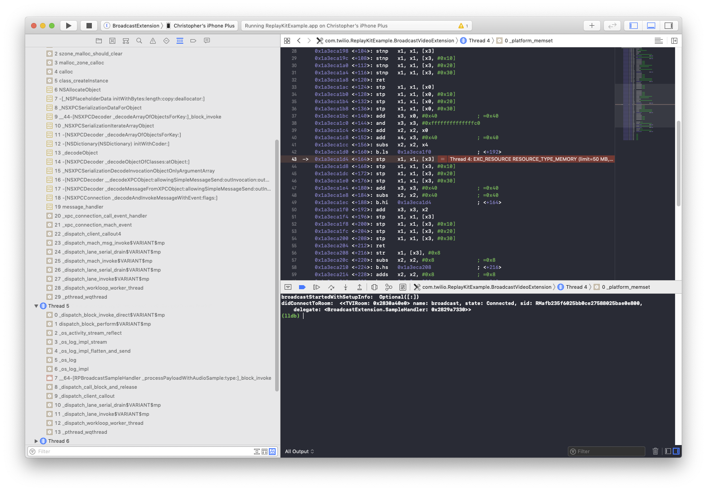

# Twilio Video ReplayKit Example

The project demonstrates how to integrate Twilio's Programmable Video SDK with `ReplayKit.framework`. Two distinct use cases are covered:

**Conferencing (In-App)**

Use an `RPScreenRecorder` to capture the screen and play/record audio using `TVIDefaultAudioDevice`. After joining a Room you will be able to hear other Participants, and they will be able to hear you, and see the contents of your screen.

When using the in-process `RPScreenRecorder` APIs, you may only capture content from your own application. Screen capture is suspended upon entering the backround. Once you being capturing, your application is locked to its current interface orientation.

**Broadcast (Extension)**

Use an `RPBroadcastSampleHandler` to receive audio and video samples. Video samples are routed to `ReplayKitVideoSource`, while `ExampleReplayKitAudioCapturer` handles audio.

An iOS 12.0 extension is not limited to capturing the screen of a single application. In fact, it is possible to capture video from any application including the home screen.

In order to reduce memory usage, the extension configures `ReplayKitVideoSource` to downscale incoming video frames, and prefers the H.264 video codec by default. In a Group Room, the extension connects as a publish-only Participant ([TVIConnectOptionsBuilder.automaticSubscriptionEnabled](https://twilio.github.io/twilio-video-ios/docs/latest/Classes/TVIConnectOptionsBuilder.html#//api/name/automaticSubscriptionEnabled)) to further reduce bandwidth, memory, and CPU requirements.

### Key Classes

**ReplayKitVideoSource**

This `TVIVideoSource` produces `TVIVideoFrame`s from `CMSampleBuffer`s captured by ReplayKit. In order to reduce memory usage, instances may be configured (via a format request) to downscale the captured content.

The source offers several capabilities to optimize for different use cases:

1. Screencast mode (In-App Conferencing). This setting preserves resolution (detail) over all else. The input from ReplayKit is always capped at 15 fps, and is not downscaled.
2. Video mode (Broadcast Extension). This setting balances spatial and temporal resolution, and is content aware. When app content is shown, the input is capped at 15 fps. However, when playback of 24 fps video content is detected the input cap is raised to preserve the native cadence of the video.
3. Real-time [Inverse Telecine (IVTC)](https://en.wikipedia.org/wiki/Telecine#Reverse_telecine_(a.k.a._inverse_telecine_(IVTC),_reverse_pulldown)). The source removes duplicate frames when it detects 24 or 25 frame / second content with 3:2 pulldown applied. Some apps (that do not use AVPlayer for playback) perform a telecine by drawing the same frame to screen multiple times.
4. A helper method to generate `EncodingParameters` and `VideoFormat` configuration based upon `VideoCodec` information and operating mode.

For performance reasons, `ReplayKit.framework` produces variable frame rate input. Importantly, this content has different properties depending on how screen capturing is being performed:

| ReplayKit API | Device | Max Frame Rate | Rotation Tags |
|-------------|----------------------|-----|-------|
| RPScreenRecorder | iPhone, iPad | 60 | No |
| RPScreenRecorder | iPad Pro | 120 | No |
| RPBroadcastSampleHandler | All | 30 | Yes |

**ExampleReplayKitAudioCapturer**

Audio capture in an extension is handled by `ExampleReplayKitAudioCapturer`, which consumes either application or microphone audio samples delivered by ReplayKit. Unfortunately, since we can't operate an Audio Unit graph in an extension, playback is not allowed.

### Setup

See the master [README](https://github.com/twilio/video-quickstart-ios/blob/master/README.md) for instructions on how to generate access tokens and connect to a Room.

You will need to provide a hardcoded token, or token server URL in [ViewController.swift](ReplayKitExample/ViewController.swift) for conferencing and in [SampleHandler.swift](BroadcastExtension/SampleHandler.swift) for the broadcast extension.

This example requires Xcode 12.0 and the iOS 12.0 SDK, as well as a device running iOS 12.0 or above. While the app launches on an iPhone Simulator, ReplayKit is non-functional.

### Running

Once you have setup your access token, install and run the example. You will be presented with the following screen:

**iOS 12**

<kbd></kbd>

**iOS 11**

<kbd></kbd>

From here you can tap "Start Broadcast" to begin using the broadcast extension. The extension will automatically join a room called "Broadcast", unless a Room is specified in your access token grants. Other Participants can join using the QuickStart example, or any other example app which can display remote video.

<kbd></kbd>

Tapping "Start Conference" begins capturing and sharing the screen from within the main application. Once you accept the screen recording permission, you can tap "Play Video" to select any mp4, or m4v video using `UIDocumentPickerViewController` and `AVPlayerViewController`. You can also tap "Browse Web" to visit a website using `SFSafariViewController`.

Please note that backgrounding the app during a conference will cause in-app capture to be suspended.

### Betterments

1. Support capturing both application and microphone audio at the same time, in an extension. Down-mix the resulting audio samples into a single stream.
2. Share the camera using ReplayKit, or `TVICameraSource`.
3. Resolve tearing issues when scrolling vertically, and image corruption when sharing video. (ISDK-2478)

### Known Issues

**1. Memory Usage**

The memory usage of a ReplayKit Broadcast Extension is limited to 50 MB (as of iOS 12.2). There are cases where Twilio Video can use more than this amount, especially when capturing larger 2x and 3x retina screens in a Peer-to-Peer Room. This example uses format requests, and H.264 to reduce the amount of memory needed by the extension.

<kbd></kbd>

It is highly recommended that you use Group Rooms with your ReplayKit extension, because the extension may connect without subscribing to Tracks.

**2. Application Audio & Copy Protection**

It is not possible to capture application audio produced by AVPlayer, by Safari video playback (even if no Fairplay DRM is used), or by the Music app.

**3. RPSystemBroadcastPickerView crashes (iOS 13.0)**

There is a [serious bug](https://stackoverflow.com/questions/57163212/get-nsinvalidargumentexception-when-trying-to-present-rpsystembroadcastpickervie) in iOS 13.0 where tapping `RPSystemBroadcastPickerView` throws an exception. Since the issue is specific to iOS 13.0, and is fixed in 13.1-beta2, the example disables usage of the picker on iOS 13.0.x releases.

> *** Terminating app due to uncaught exception 'NSInvalidArgumentException', reason: 'Application tried to present UIModalTransitionStylePartialCurl to or from non-fullscreen view controller <UIApplicationRotationFollowingController: 0x104f31220>.'

**4. RPBroadcastSampleHandler and RPSampleBufferType.audioMic leak (iOS 13.0)**

There is a memory leak in iOS 13.0 when broadcasting the screen with the microphone enabled. The leaked memory builds up and causes the extension to crash when it reaches its 50 MB resource limit. During this time, published audio might be delayed or distorted.

Testing with iOS 13.1-beta2 shows that the resource leak has been fixed in the upcoming release. If you use `RPSampleBufferType.audioMic` in an extension, then urge your customers to wait for iOS 13.1 instead.

**5. RPScreenRecorder Debugging**

It is possible to get ReplayKit into an inconsistent state when setting breakpoints in `RPScreenRecorder` callbacks. If you notice that capture is starting but no audio/video samples are being produced, then you should reset Media Services on your device.

First, end your debugging session and then navigate to: 

**Settings > Developer > Reset Media Services**

<kbd></kbd>

**6. Extension Debugging**

It is possible to get ReplayKit into an inconsistent state when debugging `RPBroadcastSampleHandler` callbacks. If this occurs you may notice the following error:

> Broadcast did finish with error: Error Domain=com.apple.ReplayKit.RPRecordingErrorDomain Code=-5808 "Attempted to start an invalid broadcast session" UserInfo={NSLocalizedDescription=Attempted to start an invalid broadcast session}

This problem may be solved by deleting and re-installing the example app.

**7. Application Audio Delay (iOS 12)**

An `RPSampleHandler` receives both application and microphone audio samples. We have found that, while microphone samples are suitable for realtime usage, application audio samples are significantly delayed in iOS 12 releases. This delay results in poor audio quality for subscribers (even under ideal network conditions), since the extension delivers audio in bursts rather than continuously.

The following table shows measurements from an iPhone X running iOS 12.4.1.

| Sample Type | Format                          | Sample Size (Frames) | Period (milliseconds) |
|-------------|---------------------------------|----------------------|-----------------------|
| Application | 1ch, 44,100 Hz, Big Endian    | 22,596               | 512.3                 |
| Microphone  | 1ch, 44,100 Hz, Little Endian | 1,024                | 23.2                  |

This problem is solved in iOS 13.0, which supports low-delay mono and stereo application audio. The following table shows measurements from an iPhone 7 Plus running iOS 13.0:

| Sample Type | Format                          | Sample Size (Frames) | Period (milliseconds) |
|-------------|---------------------------------|----------------------|-----------------------|
| Application | 1 or 2ch, 44,100 Hz, Big Endian    | 1,024               | 23.2                 |
| Microphone  | 1ch, 44,100 Hz, Little Endian | 1,024                | 23.2                  |

**8. RPScreenRecorder Content Sizing Error (iOS 12)**

You might experience spurious failures while presenting the permissions dialog for `RSPScreenRecorder`  on iOS 12 devices.

> Error Domain=com.apple.ReplayKit.RPRecordingErrorDomain Code=-5807 "Recording interrupted by multitasking and content resizing" UserInfo={NSLocalizedDescription=Recording interrupted by multitasking and content resizing})

This issue may be resolved by upgrading your device to iOS 13.0 and above.
